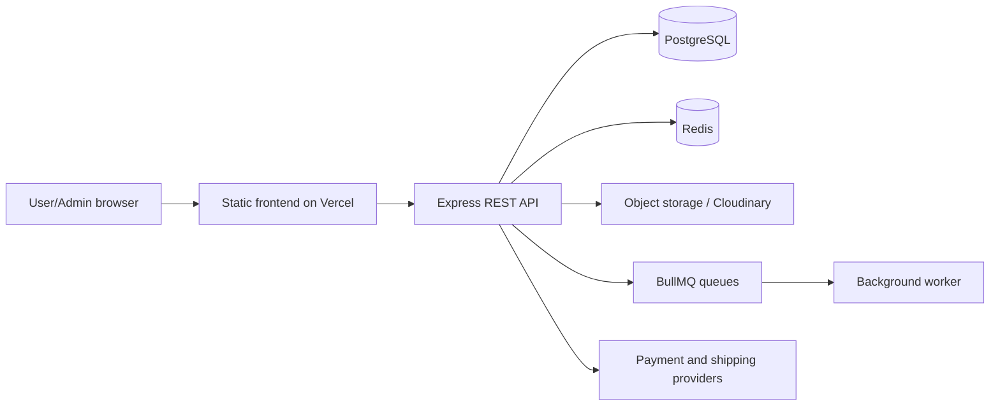

# ShopVN E-commerce

ShopVN là đồ án thương mại điện tử bán thiết bị công nghệ, gồm frontend HTML/CSS/Vanilla JavaScript và REST API Node.js/Express. Dự án tập trung vào luồng mua hàng có thể kiểm chứng, phân quyền user/admin, quản lý đơn và tồn kho, xử lý nền bằng BullMQ, cùng các tích hợp thanh toán Việt Nam ở chế độ cấu hình theo môi trường.

> Working tree hiện tại là bản đang phát triển. Website public có thể chưa chứa các thay đổi local mới nhất cho đến khi được deploy và smoke-test lại.

## Liên kết

- Frontend public: [shopvn-ecommerce.vercel.app](https://shopvn-ecommerce.vercel.app/)
- Backend public: [shopvn-backend.onrender.com](https://shopvn-backend.onrender.com/health)
- API documentation: [Swagger UI](https://shopvn-backend.onrender.com/api-docs/)
- Hồ sơ đồ án: [docs/capstone/README.md](docs/capstone/README.md)
- QA checklist: [QA_TEST_CHECKLIST.md](QA_TEST_CHECKLIST.md)
- Deployment guide: [DEPLOYMENT.md](DEPLOYMENT.md)

## Phạm vi chức năng

### Người mua

- Đăng ký, đăng nhập, refresh token và đăng xuất.
- Duyệt, tìm kiếm, lọc, sắp xếp và xem chi tiết sản phẩm.
- Đồng bộ giỏ hàng, kiểm tra tồn kho và tính tổng tiền phía server.
- Checkout, tạo đơn, xem lịch sử và hủy đơn hợp lệ.
- COD, chuyển khoản và adapter sandbox cho VNPay, ZaloPay, MoMo, PayOS.
- Wishlist, compare, review, giao diện sáng/tối và responsive.

### Quản trị và vận hành

- RBAC bảo vệ API admin.
- Quản lý sản phẩm, đơn hàng và dashboard vận hành.
- Theo dõi inventory transaction và quy trình OMS.
- BullMQ/Redis cho email và background jobs.
- Health/readiness endpoint, request ID, rate limit và structured error response.

## Kiến trúc



Backend đi theo luồng `route -> middleware -> controller -> service -> model`. Frontend dùng `js/api.js` làm lớp gọi API chung; endpoint chính được version hóa dưới `/api/v1`.

Các quyết định, trade-off và sơ đồ chi tiết nằm trong:

- [Architecture](docs/capstone/03-ARCHITECTURE.md)
- [Data and API](docs/capstone/04-DATA-AND-API.md)
- [Decision log](docs/capstone/DECISION-LOG.md)
- [Traceability matrix](docs/capstone/TRACEABILITY.md)

## Công nghệ

| Layer | Công nghệ chính |
|---|---|
| Frontend | HTML5, CSS3, Vanilla JavaScript, Service Worker |
| Backend | Node.js 20+, Express 5, Joi, JWT, bcryptjs |
| Data | PostgreSQL, Sequelize, Redis |
| Async | BullMQ worker |
| Integrations | Cloudinary, Nodemailer, GHN, VNPay, ZaloPay, MoMo, PayOS |
| Quality | Jest, Chrome DevTools, Swagger/OpenAPI |
| Delivery | GitHub Actions, Docker Compose, Render Blueprint, Vercel |

## Chạy local

### Yêu cầu

- Node.js 20+
- PostgreSQL 15+
- Redis 7+
- Python hoặc một static file server tương đương

### Backend

```powershell
cd "D:\E-Commerce Website\ecommerce-backend"
Copy-Item .env.example .env
npm ci
npm run db:migrate
npm run db:seed
npm start
```

`db:seed` chỉ dùng khi cần dữ liệu local/demo. Điền biến môi trường thật trong `.env`; không commit file này.

Chạy worker ở terminal khác:

```powershell
cd "D:\E-Commerce Website\ecommerce-backend"
npm run worker
```

### Frontend

```powershell
cd "D:\E-Commerce Website"
python -m http.server 8891 --bind 127.0.0.1
```

Mở `http://127.0.0.1:8891/`. Khi test local backend, cấu hình `js/config.js` bằng URL phù hợp; production không được gọi `localhost`.

## Biến môi trường

Sao chép [ecommerce-backend/.env.example](ecommerce-backend/.env.example) và cấu hình theo môi trường. Nhóm bắt buộc gồm:

- Database: `DATABASE_URL` hoặc `DB_HOST`, `DB_PORT`, `DB_NAME`, `DB_USER`, `DB_PASSWORD`.
- Authentication: `JWT_SECRET`, `JWT_REFRESH_SECRET`.
- Origins: `FRONTEND_URL`, `ADMIN_URL`, `CORS_ORIGINS`.
- Marketplace webhook production: `WEBHOOK_SHARED_SECRET`.
- Redis/queue: `REDIS_URL` hoặc các biến `REDIS_*`.

Credential payment, email, upload, shipping và chatbot là tùy chọn; chỉ bật integration đã cấu hình đủ. Không đưa giá trị secret vào frontend, tài liệu, issue hoặc log.

## Kiểm thử

```powershell
cd "D:\E-Commerce Website\ecommerce-backend"
npm run test:ci
npm audit --omit=dev
```

Kiểm tra syntax frontend:

```powershell
Get-ChildItem ..\js -Recurse -Filter *.js | ForEach-Object { node --check $_.FullName }
```

Quy trình đầy đủ gồm unit/service tests, API smoke, Chrome responsive/light-dark, accessibility, Lighthouse và UAT. Chỉ ghi `Pass` khi có log, screenshot, URL hoặc biên bản tương ứng; xem [Test and security plan](docs/capstone/06-TEST-SECURITY-PLAN.md).

## Database và khôi phục

Migration production chạy qua PostgreSQL advisory lock:

```powershell
npm run db:migrate
npm run db:migrate:status
```

Logical JSON backup chỉ dành cho local/demo và chứa dữ liệu nhạy cảm:

```powershell
npm run db:backup
npm run db:restore -- backups\backup_YYYY-MM-DD_HH-mm-ss.json --confirm
```

Production nên dùng snapshot hoặc `pg_dump` được mã hóa và phải diễn tập restore trên database cách ly. Xem [Deployment runbook](docs/capstone/07-DEPLOYMENT-RUNBOOK.md).

## Docker và deployment

```powershell
cd "D:\E-Commerce Website\ecommerce-backend"
docker compose config --quiet
docker compose up --build
```

Compose yêu cầu tối thiểu `POSTGRES_PASSWORD`, `JWT_SECRET` và `JWT_REFRESH_SECRET`. [render.yaml](render.yaml) mô tả web service, worker, PostgreSQL và Redis cho Render; frontend dùng [vercel.json](vercel.json).

Không coi deployment hoàn tất chỉ vì build thành công. Release cần kiểm tra `/health`, `/ready`, CORS, auth, cart/order, worker và provider sandbox đã bật.

## Cấu trúc chính

```text
.
|-- *.html                    # Các màn frontend
|-- css/                      # Design tokens, components, page styles
|-- js/                       # API client và page controllers
|-- admin/                    # Admin dashboard
|-- docs/capstone/            # Hồ sơ đề xuất đến portfolio/UAT
|-- ecommerce-backend/
|   |-- src/controllers/
|   |-- src/middlewares/
|   |-- src/services/
|   |-- src/models/
|   |-- src/workers/
|   |-- migrations/
|   |-- __tests__/
|   `-- scripts/
|-- render.yaml
`-- vercel.json
```

## Nguyên tắc an toàn

- Server tính giá, discount và tổng đơn; không tin dữ liệu tiền từ client.
- Payment callback phải qua chữ ký provider, amount match và finalization idempotent.
- API user/admin dùng authentication và authorization phù hợp.
- Input được Joi validate và sanitize; Sequelize dùng query parameter hóa.
- Refresh token được rotate/revoke; secret production phải đủ mạnh và khác nhau.
- Backup, log và evidence không được chứa token, credential hoặc dữ liệu cá nhân không cần thiết.

## Hồ sơ bảo vệ và portfolio

Bộ [docs/capstone](docs/capstone/README.md) bao phủ proposal, SRS, use case, C4/ERD, API/data dictionary, sprint/DoD, test-security plan, deployment/rollback, UAT/demo, câu hỏi bảo vệ và case study portfolio. Các trường cần người thật, môi trường public hoặc số liệu đo được giữ ở trạng thái `TBD`; dự án không tự tạo bằng chứng.

## License

ISC.
