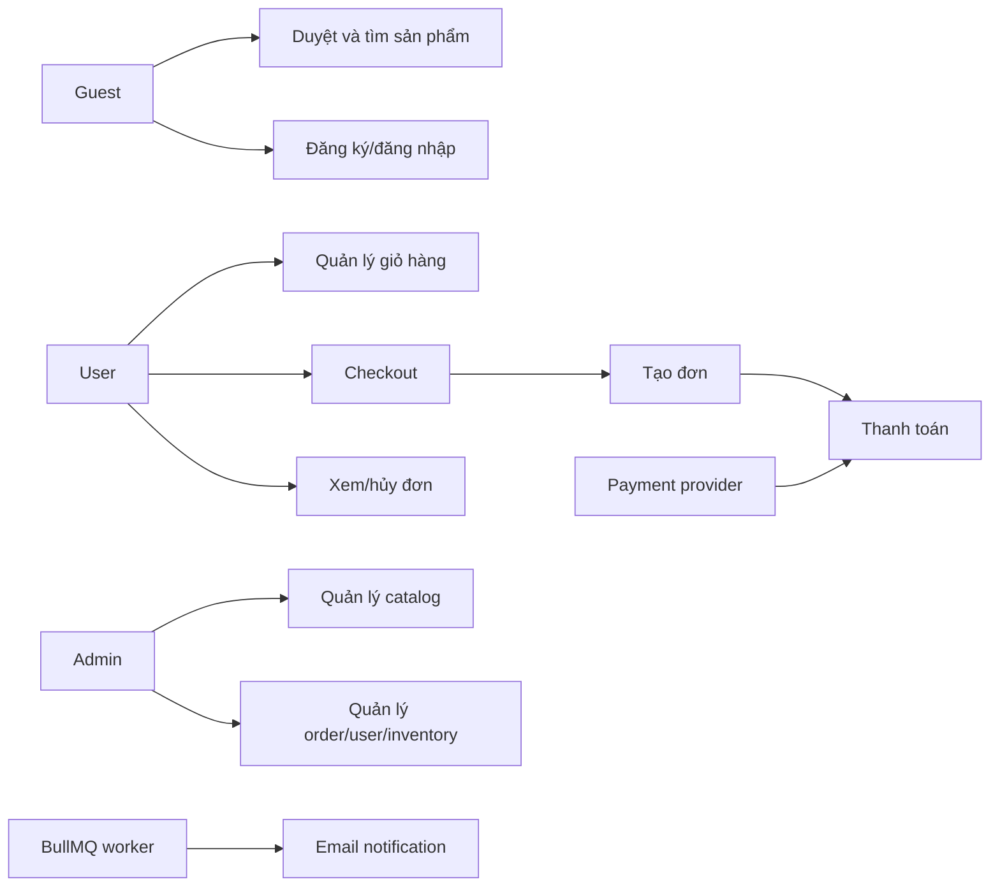

# Yêu cầu hệ thống ShopVN

## 1. Actor

| Actor | Quyền chính |
|---|---|
| Guest | Duyệt/search/filter sản phẩm, đăng ký, đăng nhập |
| User | Quản lý cart, checkout, payment, order, review |
| Admin | Quản lý product, order, user và inventory |
| Payment Provider | Gửi signed return/IPN/webhook |
| Background Worker | Gửi email và xử lý job bất đồng bộ |

## 2. Use case tổng quát

## 3. Functional requirements

| ID | Yêu cầu | Acceptance criteria chính | Ưu tiên |
|---|---|---|---|
| FR-AUTH-01 | Đăng ký | Email hợp lệ/unique, password >= 8, hash bcrypt, trả token không lộ password | Must |
| FR-AUTH-02 | Đăng nhập | Credential đúng trả access/refresh; sai trả lỗi chung | Must |
| FR-AUTH-03 | Refresh token | Token hợp lệ được rotate; reuse/revoked token bị từ chối | Must |
| FR-AUTH-04 | Logout | Server revoke refresh/access liên quan; client xóa token | Must |
| FR-AUTH-05 | RBAC | User không gọi được admin API; anonymous nhận 401 | Must |
| FR-PROD-01 | Danh sách sản phẩm | Render dữ liệu API với loading/error/empty | Must |
| FR-PROD-02 | Chi tiết sản phẩm | Hiển thị ảnh, tên, giá, tồn kho, mô tả và CTA theo stock | Must |
| FR-PROD-03 | Search/filter/sort | Query theo tên, category, brand/status/price hỗ trợ theo API/UI hiện có | Must |
| FR-PROD-04 | Review | User phù hợp gửi rating/comment hợp lệ; rating tổng hợp không giả mặc định | Should |
| FR-CART-01 | Thêm/cập nhật/xóa | Quantity nguyên dương, không vượt stock, total cập nhật | Must |
| FR-CART-02 | Đồng bộ cart | Cart thuộc user; sync atomic, reject duplicate/missing/overstock | Must |
| FR-ORDER-01 | Checkout | Bắt buộc đăng nhập, cart không rỗng, receiver data hợp lệ | Must |
| FR-ORDER-02 | Tạo đơn | Lưu user/items/snapshot price/discount/shipping/total trong transaction | Must |
| FR-ORDER-03 | Lịch sử đơn | User chỉ xem đơn của mình và trạng thái từ backend | Must |
| FR-ORDER-04 | Hủy đơn | Chỉ trạng thái hợp lệ được hủy; reserved stock trả đúng một lần | Must |
| FR-PAY-01 | COD | Tạo đơn không cần redirect provider | Must |
| FR-PAY-02 | Online payment create | Chỉ owner tạo payment cho đơn chưa paid/cancelled | Must |
| FR-PAY-03 | Payment webhook | Verify signature, order, amount; finalization idempotent và row lock | Must |
| FR-PAY-04 | Provider failure | Không báo đặt hàng thất bại nếu order đã tạo; hướng user về lịch sử đơn | Must |
| FR-ADMIN-01 | Product management | Admin CRUD product với validation và ảnh URL an toàn | Must |
| FR-ADMIN-02 | Order management | Admin xem/update status chỉ trong enum model | Must |
| FR-ADMIN-03 | User management | Admin xem/quản lý user theo API hiện có, không lộ password hash | Should |
| FR-WMS-01 | Inventory | Reserve/commit/release được ghi transaction và không xử lý trùng payment | Should |
| FR-JOB-01 | Background job | Job retry/backoff; email error được throw để BullMQ retry/DLQ | Should |
| FR-OBS-01 | Health | `/health` cho liveness, `/ready` phản ánh DB/Redis readiness | Must |

## 4. User story mẫu

### US-01 Mua hàng COD

Là một user đã đăng nhập, tôi muốn đặt các sản phẩm trong giỏ bằng COD để nhận xác nhận đơn mà không cần cổng thanh toán.

Acceptance criteria:

1. Checkout bị chặn nếu cart rỗng hoặc receiver data thiếu/sai.
2. Tổng tiền do backend tính từ product snapshot, voucher và shipping rule.
3. Khi thành công, cart được clear và đơn xuất hiện trong lịch sử.
4. Refresh trang không tạo đơn trùng khi idempotency key được dùng.

### US-02 Thanh toán online an toàn

Là một user, tôi muốn redirect sang provider và thấy trạng thái đơn chính xác khi quay lại.

Acceptance criteria:

1. Endpoint create chỉ nhận order thuộc user.
2. Callback sai signature hoặc sai amount không đánh dấu paid.
3. Callback lặp không commit inventory/cộng loyalty lần hai.
4. Đơn cancelled không được hồi sinh thành processing.

### US-03 Admin xử lý đơn

Là admin, tôi muốn lọc và cập nhật trạng thái đơn để vận hành fulfillment.

Acceptance criteria:

1. Anonymous nhận 401; role user nhận 403.
2. Status chỉ thuộc `pending`, `processing`, `shipping`, `delivered`, `cancelled`.
3. Thay đổi hiển thị lại cho user qua API lịch sử đơn.

## 5. Business rules

| ID | Rule |
|---|---|
| BR-01 | Giá/tổng tiền có đơn vị VND và backend là nguồn tính toán cuối cùng. |
| BR-02 | Shipping hiện là 30.000 VND, miễn phí khi subtotal >= 500.000 VND. |
| BR-03 | Discount không được làm total nhỏ hơn 0. |
| BR-04 | Product quantity tối thiểu 1 và không vượt stock khả dụng. |
| BR-05 | Chỉ owner hoặc admin theo route được xem/thay đổi order. |
| BR-06 | Online payment chỉ hoàn tất sau callback có chữ ký hợp lệ và amount khớp. |
| BR-07 | File/ảnh lưu ngoài DB; DB chỉ giữ URL/metadata. |
| BR-08 | Không hiển thị viewers/sold/urgency ngẫu nhiên như dữ liệu thật. |

## 6. Non-functional requirements

| ID | Nhóm | Yêu cầu/target | Cách đo |
|---|---|---|---|
| NFR-SEC-01 | Security | Secret ngoài Git; bcrypt; JWT ngắn hạn; RBAC; rate limit | Static review + API tests |
| NFR-SEC-02 | Webhook | HMAC timing-safe, amount match, idempotency | Unit/integration tests |
| NFR-PERF-01 | Web | CLS <= 0.1; Lighthouse target theo proposal | Lighthouse |
| NFR-PERF-02 | API | Pagination <= 100; cache dữ liệu đọc phù hợp | API/load test |
| NFR-REL-01 | Reliability | Migration fail thì service không start; queue retry | CI/deploy drill |
| NFR-REL-02 | Recovery | Có backup/restore/rollback runbook | Restore drill `TBD` |
| NFR-A11Y-01 | Accessibility | Keyboard, label, focus, contrast WCAG 2.2 cơ bản | Axe/Lighthouse/manual |
| NFR-RESP-01 | Responsive | Không horizontal overflow tại 360-1440px | Chrome viewport matrix |
| NFR-OBS-01 | Observability | Request ID, structured log, health/readiness | Runtime smoke test |
| NFR-MAINT-01 | Maintainability | CI test/audit/migration; ADR và traceability cập nhật | PR checklist |

## 7. Requirement change control

Mọi thay đổi Must-have cần: lý do, ảnh hưởng API/DB/UI/security, acceptance criteria mới, test tương ứng, migration/rollback nếu có và cập nhật `TRACEABILITY.md`. Feature chưa có bằng chứng không được mô tả là đã hoàn thành.
