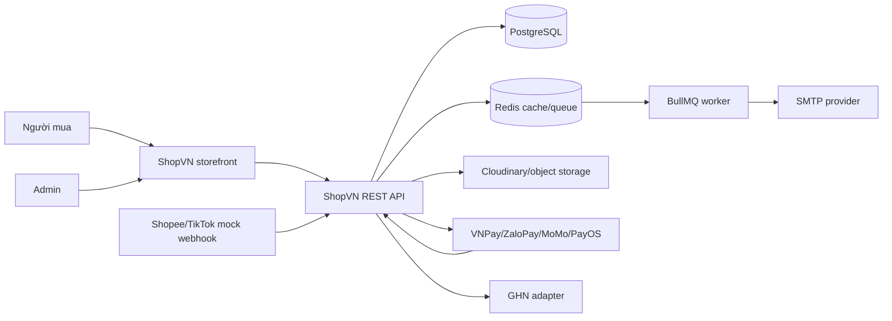
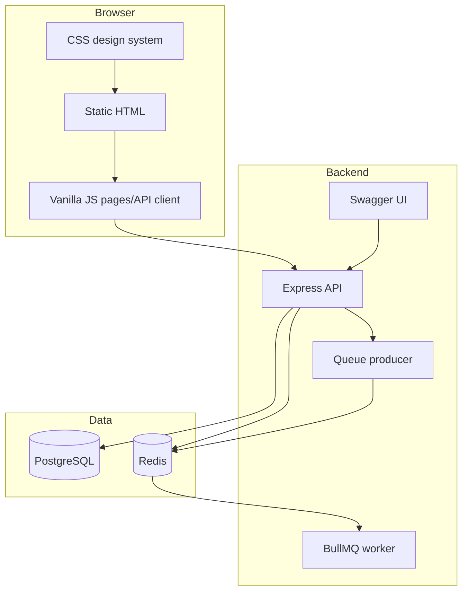
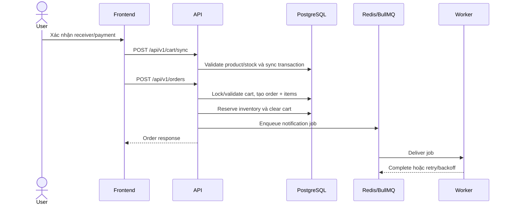
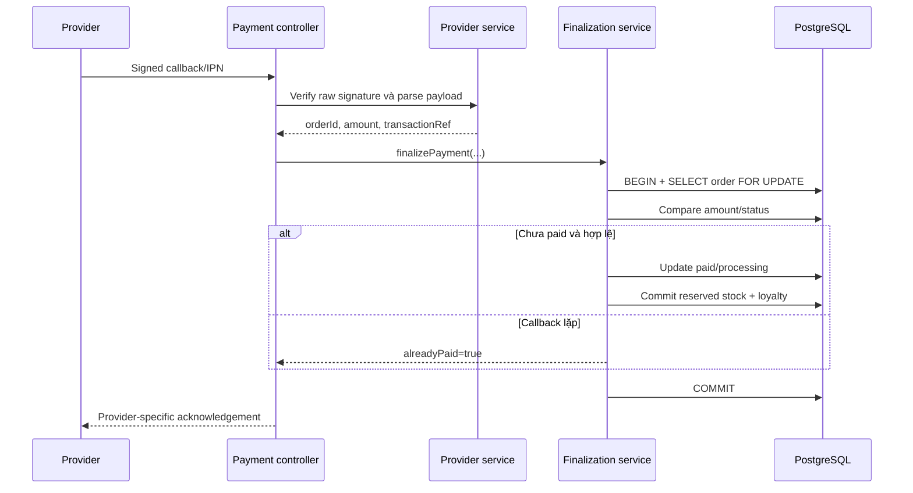

# Kiến trúc ShopVN

## 1. Kiến trúc hiện tại

ShopVN là modular monolith: một Express API tổ chức theo route/controller/service/model, một BullMQ worker độc lập và frontend tĩnh. Cách này phù hợp quy mô đồ án, giảm chi phí vận hành nhưng vẫn cho phép scale web/worker riêng. Dự án chưa cần microservices; chỉ tách service khi có bằng chứng về team ownership, deploy cadence hoặc tải độc lập.

## 2. System context

## 3. Container view

## 4. Backend component view

| Layer | Trách nhiệm | Ví dụ |
|---|---|---|
| Middleware | Auth/RBAC, validation, rate limit, security, idempotency, cache | `auth.middleware.js`, `validation.middleware.js` |
| Route | HTTP method/path và middleware composition | `src/routes/*.routes.js` |
| Controller | HTTP response, ownership, provider response format | `order.controller.js`, `payment.controller.js` |
| Service | Business transaction và external adapter | `order.service.js`, `payment.service.js` |
| Model/Migration | Persistence contract | `src/models`, `migrations` |
| Queue/Worker | Retryable side effects | `src/lib/queues.js`, `background.worker.js` |
| Observability | Request ID, metrics, structured log, health | `app.js`, `src/config/logger.js` |

## 5. Luồng checkout

## 6. Luồng payment callback

Invariant:

- Chữ ký hợp lệ chưa đủ; amount phải khớp `orders.total`.
- Row lock + `paymentStatus` ngăn callback lặp tạo side effect lần hai.
- Đơn `cancelled` không được chuyển lại `processing`.
- Lỗi tạm thời trả non-success để provider retry; không nuốt lỗi thành success.

## 7. Storage và cache

- PostgreSQL lưu user, product metadata, cart, order snapshot, review, inventory và loyalty.
- Ảnh/file không lưu BLOB trong PostgreSQL; model giữ `imageUrl`.
- Redis dùng cho cache, rate/queue state và BullMQ. Queue production dùng `noeviction` để giảm nguy cơ mất job do eviction.
- Cache phải có TTL/invalidation; database vẫn là nguồn sự thật.

## 8. Scalability path

| Giai đoạn | Trigger bằng chứng | Hành động |
|---|---|---|
| Hiện tại | Một web instance đủ, team nhỏ | Modular monolith + managed DB/Redis |
| Scale web | CPU/latency/concurrency vượt target | Nhiều stateless API instance + load balancer |
| Scale async | Queue lag tăng | Scale worker/concurrency riêng, DLQ monitoring |
| Scale read | Query read là bottleneck đã đo | Index, cache, read replica |
| Tách service | Ownership/deploy/tải độc lập rõ | Tách bounded context, contract/event versioning |

Không chọn microservices chỉ để “trông production”. Chi phí distributed transaction, observability, deploy và consistency phải có lý do định lượng.

## 9. Failure modes

| Failure | Expected behavior | Evidence cần có |
|---|---|---|
| PostgreSQL down | `/ready` 503; mutation fail, không trả success giả | Smoke/chaos test `TBD` |
| Redis down | Cache miss fallback phù hợp; queue job không báo đã enqueue giả | Integration test `TBD` |
| Worker down | Job giữ trong Redis và xử lý sau khi worker trở lại | Queue recovery test `TBD` |
| Provider timeout | Order vẫn tồn tại; user xem trạng thái pending và retry | Payment UI/API test |
| Duplicate webhook | Một lần commit kho/loyalty | Unit test finalization |
| Wrong webhook amount | Reject, order không paid | Unit/integration test |
| Frontend API down | Error state có retry, không giả thành production data | Browser test |

## 10. Security boundaries

- Browser không chứa secret; chỉ gửi bearer token.
- Admin authorization kiểm tra ở backend, không dựa vào ẩn UI.
- Payment/marketplace callbacks có signature/shared secret; IP allowlist chỉ là lớp tùy chọn.
- Upload qua memory storage, loại/size validation và object storage adapter.
- PII trong order chỉ trả cho owner/admin theo route; log không ghi token/password.

