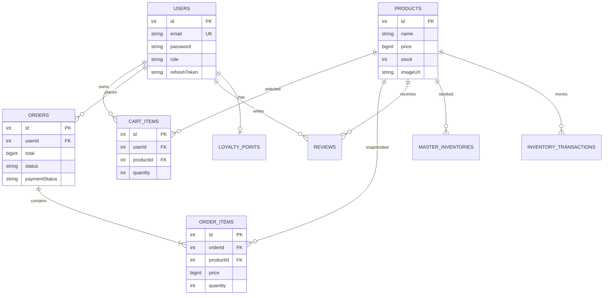

# Dữ liệu và API contract

## 1. ERD mức logic



## 2. Data dictionary tóm tắt

| Table/model | Dữ liệu quan trọng | Quy tắc |
|---|---|---|
| `users` | name, email, phone, password, provider, role, refreshToken | email unique; default scope loại password/refresh token |
| `products` | name, description, price, oldPrice, category, imageUrl, stock | price không âm; ảnh là URL; không lưu BLOB |
| `cart_items` | userId, productId, quantity | cặp user/product duy nhất; quantity >= 1 |
| `orders` | receiver, subtotal, shippingFee, discount, total, status, payment fields | total backend-calculated; status enum; user ownership |
| `order_items` | productName/icon, price, quantity, subtotal | snapshot để lịch sử không đổi khi product đổi |
| `reviews` | userId, productId, rating, comment | rating 1-5; validation và ownership rule |
| `master_inventories` | productId, warehouseId, available/reserved/locked | mutation trong transaction |
| `inventory_transactions` | productId, type, quantity, referenceId, channel | audit trail của thay đổi kho |
| `loyalty_points` | userId, points, tier, totalSpent | cập nhật cùng payment finalization |
| `action_plans` | clientPlanId, task counters, JSON payload | dữ liệu công cụ admin hiện có |

## 3. API conventions

- Base path: `/api/v1`.
- JSON UTF-8; tiền là số nguyên VND ở business boundary.
- Protected route dùng `Authorization: Bearer <accessToken>`.
- Pagination mặc định từ schema và `limit <= 100`.
- Mutation quan trọng có thể gửi `Idempotency-Key`.
- Error response chuẩn:

```json
{
  "success": false,
  "message": "Thông báo an toàn cho client",
  "requestId": "trace-id"
}
```

Validation error có thể thêm `errors: [{ "field": "...", "message": "..." }]`. Production 5xx không trả stack trace hay raw database/provider error.

## 4. Endpoint groups

| Base path | Endpoint tiêu biểu | Auth |
|---|---|---|
| `/auth` | `POST /register`, `/login`, `/social`, `/refresh`, `/logout`; `GET /me` | Theo endpoint |
| `/products` | `GET /`, `GET /:id` | Public read |
| `/cart` | `GET/POST /`, `POST /sync`, `PUT/DELETE /:id` | User |
| `/orders` | `POST/GET /`, `GET /:id`, `PATCH /:id/cancel` | User |
| `/reviews` | `GET /product/:productId`, `POST /product/:productId` | Read public, write user |
| `/admin` | Product/order/stats/action-plan endpoints | Admin |
| `/payment` | Create/status, VNPay return/IPN, provider webhooks | Owner hoặc provider signature |
| `/upload` | Product image/upload endpoints | Admin theo route config |
| `/shipping` | Location/rate/create/track adapter | Theo route hiện có |
| `/webhooks` | `POST /shopee`, `/tiktok` | Shared secret/HMAC |
| `/wms` | Barcode/inventory operations | Theo route hiện có |
| `/chatbot` | `POST /ask` | Rate-limited |

Contract chi tiết phải được lấy từ Swagger `/api-docs` và source route/schema tại cùng commit. Bảng này là bản đồ, không thay Swagger.

## 5. Payment provider mapping

| Provider | Create | Callback | Integrity |
|---|---|---|---|
| VNPay | `POST /payment/vnpay/create` | `GET /vnpay/return`, `/vnpay/ipn` | HMAC SHA-512 trong adapter |
| ZaloPay | `POST /payment/zalopay/create` | `POST /webhooks/zalopay/callback` | Raw `data` HMAC SHA-256 key2 |
| MoMo | `POST /payment/momo/create` | `POST /webhooks/momo/callback` | Documented field-string HMAC SHA-256 |
| PayOS | `POST /payment/bank-transfer/create` | `POST /webhooks/payos/callback` | Sorted canonical data HMAC SHA-256 |

Tài liệu protocol chính thức:

- [VNPay sandbox integration](https://sandbox.vnpayment.vn/apis/docs/thanh-toan-pay/pay.html)
- [ZaloPay create order](https://docs.zalopay.vn/docs/specs/order-create/)
- [MoMo one-time wallet](https://developers.momo.vn/v3/docs/payment/api/wallet/onetime/)
- [PayOS API](https://payos.vn/docs/api/)

## 6. Migration strategy

1. Mỗi thay đổi schema có một migration forward và `down` khả thi khi an toàn.
2. Không dùng `sequelize.sync({ alter: true })` ở production.
3. `npm run db:migrate` lấy PostgreSQL advisory lock để web/worker không migrate song song.
4. CI chạy migration trên database trống trước Jest.
5. Trước migration production: backup, kiểm tra dung lượng/lock, xác định rollback.
6. Breaking schema dùng expand-and-contract: thêm field nullable, backfill, deploy reader/writer, rồi mới siết constraint/xóa field ở release sau.

## 7. Data protection

- Password chỉ lưu bcrypt hash; không xuất qua default scope.
- Refresh token là dữ liệu nhạy cảm, không log/serialize ra client ngoài auth flow cần thiết.
- Receiver name/phone/address là PII; giới hạn quyền đọc và thời gian giữ theo policy `TBD`.
- Backup phải mã hóa và kiểm soát access; restore drill cần ghi timestamp/kết quả.
- Không copy production data thật vào demo; dùng seed giả lập không định danh.

